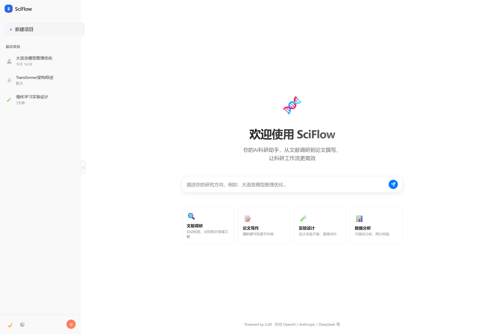
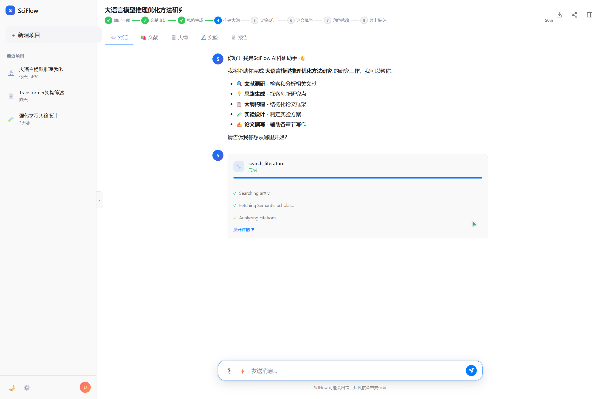
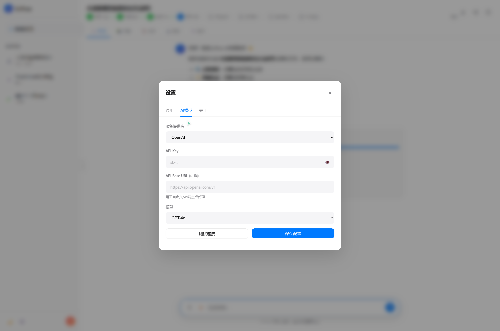
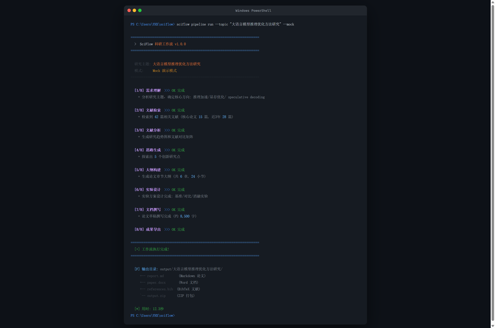
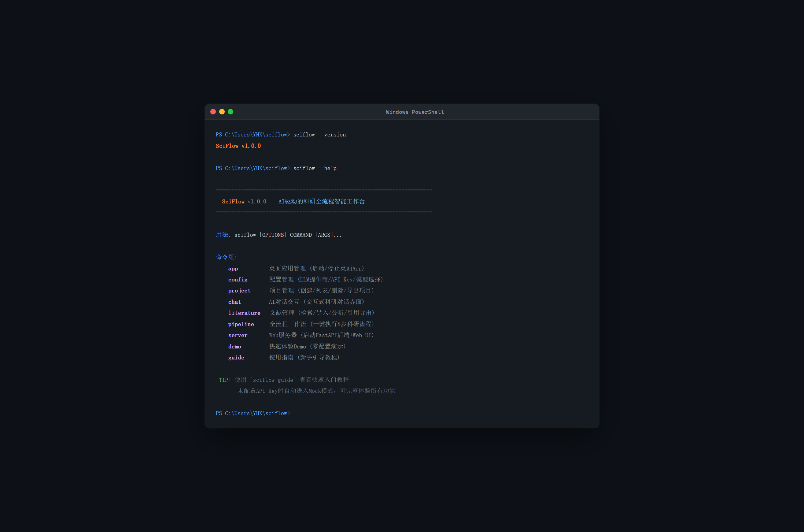

# 【标签】学习工作

# 【标题】学习工作赛道 - SciFlow v1.0：AI驱动的科研全流程智能工作台

---

## 1. Demo 简介

**是什么：** SciFlow 是一款面向科研工作者的 AI 智能工作台，提供**桌面应用 + Web界面 + CLI命令行**三种使用方式。用自然语言驱动从文献调研到论文撰写的完整科研流程，内置支持 OpenAI / DeepSeek / Claude / 智谱 / 通义千问 / Ollama 等多种大模型，开箱即用 Mock 模式无需配置即可体验。

**面向谁：** 理工科研究生、科研工作者、学术写作者

**主要功能：**

- 🖥️ **三模式统一体验**：桌面App（pywebview原生窗口，类Notion/Obsidian体验）、Web UI（ChatGPT级精致界面）、CLI命令行，共享同一套核心引擎
- 💬 **AI对话式科研**：ChatGPT风格流式对话，自然语言描述研究主题，AI自动理解并启动8步科研工作流
- 🔌 **多LLM灵活接入**：图形界面配置6家主流LLM提供商（OpenAI/Anthropic/DeepSeek/智谱/通义千问/Ollama），支持自定义API Base URL和模型名称
- 📚 **智能文献调研**：自动检索相关文献，生成文献矩阵对比、研究趋势分析，一键导出BibTeX/GB-T 7714引用格式
- 📋 **8步自动化工作流**：需求理解→文献检索→文献分析→思路生成→大纲构建→实验设计→文档撰写→成果导出，可视化进度条实时追踪
- 📦 **成果一键导出**：Markdown报告、Word论文、BibTeX参考文献、ZIP打包下载
- 🌓 **深浅主题切换**：苹果/Notion级极简UI设计，支持跟随系统/浅色/深色三种主题模式
- 💾 **本地数据优先**：SQLite本地存储，所有数据保存在用户本机，保护隐私安全

**产品截图——欢迎界面：**



> 清爽的三栏布局：左侧项目栏、中央对话欢迎页、底部输入框，四个快捷功能卡片一键启动常用功能

**产品截图——对话工作区：**



> 对话式交互界面：顶部8步工作流进度条（已完成步骤显示绿色✓，当前步骤蓝色高亮），中部对话区支持Markdown渲染和函数调用卡片，底部Tab切换对话/文献/大纲/实验/报告多视图

**产品截图——设置与LLM配置：**



> AI模型配置面板：下拉选择6家LLM提供商，输入API Key，自定义Base URL和模型名称，支持测试连接一键验证

---

## 2. Demo 创作思路

**灵感来源：** 作为一名理工科研究者，我深切体会到科研工作中工具碎片化的痛点——写论文要在Zotero（文献管理）、Google Scholar（检索）、ChatGPT（写作辅助）、Word（排版）、Python（数据分析）之间反复切换，大量时间消耗在重复劳动而非创新思考上。现有的AI工具（如ChatGPT、Claude）虽然强大，但缺乏面向科研场景的**流程编排能力**——它们能回答单个问题，却无法串联起从选题到成稿的完整链路。

**想解决的问题：**

1. **工具碎片化**：研究者需要在5+个工具间切换，数据流转断点多，格式转换繁琐
2. **流程断点**：文献调研→思路生成→大纲构建→论文撰写各环节割裂，没有自动化衔接
3. **配置门槛高**：很多AI科研工具配置复杂，对非计算机背景的研究者不友好
4. **数据隐私顾虑**：云端SaaS产品存在研究数据泄露风险，论文草稿不愿上传至第三方服务器
5. **输出不规范**：AI生成的文献引用格式混乱，需要手动调整为BibTeX或GB-T 7714标准格式

**为什么做这个方向：**
- 科研效率工具是强刚需市场，全球有数千万科研工作者面临同样的痛点
- Agent编排技术是实现端到端科研自动化的最佳技术路径
- Trae IDE的AI编程能力让我能快速将一个CLI原型升级为三模式统一的商业级产品
- 选择Python技术栈，让科研用户（大多数熟悉Python）能轻松二次开发和扩展
- 本地优先 + 多LLM支持的设计哲学，兼顾隐私安全和使用灵活性
- MIT协议完全开源，希望能帮助更多研究者摆脱重复劳动

---

## 3. Demo 体验地址

**GitHub开源仓库：** https://github.com/Yhx888/sciflow

**三种快速体验方式：**

**方式一：Web Demo（推荐，零安装）**
```bash
pip install sciflow
sciflow demo
# 浏览器自动打开 http://127.0.0.1:8765/static/index.html
```
未配置API Key时自动进入Mock模式，可完整体验所有界面和工作流流程，无需任何配置。

**方式二：桌面应用**
```bash
pip install sciflow[desktop]
sciflow-app
```
启动原生桌面窗口体验，类似Notion/Obsidian的桌面App体验，独立窗口不占用浏览器标签页。

**方式三：CLI全流程一键演示**
```bash
pip install sciflow
sciflow pipeline run --topic "大语言模型推理优化" --mock
```
命令行中观看8步工作流自动执行，彩色进度条实时显示每步状态，最终在output目录生成完整报告。

**CLI运行效果：**



**EXE打包：** 项目提供 `python build_exe.py` 打包脚本（需安装pyinstaller），可生成独立EXE可执行文件，无需Python环境即可分发使用，方便分享给不熟悉Python的同学。

**CLI帮助信息：**



---

## 4. TRAE 实践过程

整个项目从v0.2的简单CLI原型，在Trae IDE中完成了**架构重构和商业级升级**。核心过程分为以下五个阶段：

**关键步骤1：需求分析与架构规划**

最初的SciFlow只是一个单文件CLI脚本，功能简陋。在Trae中我首先提出了升级目标："打造成可商业交付的三模式产品"。Trae辅助我完成了深度需求分析，从"CLI工具"重新定位为"桌面App + Web + CLI三模式统一产品"，并设计了清晰的五层模块化架构：

- `core/`：业务逻辑层（配置管理、数据模型、数据库、文献管理、工作流引擎、成果生成）
- `llm/`：多模型客户端层（自研轻量LLM客户端，不依赖litellm）
- `server/`：FastAPI后端层（REST API + SSE流式响应）
- `desktop/`：桌面启动层（pywebview桌面壳，后台线程启动服务器）
- `web/`：Web前端层（ChatGPT级单页应用）

**【📸 请在此处补充截图5：Trae IDE中架构规划的对话截图——展示你在Trae中与AI讨论架构设计的对话界面】**

**关键步骤2：后端核心模块开发**

使用Trae辅助开发了完整的FastAPI异步后端，核心亮点：

- **自研轻量LLM客户端**：没有使用litellm（依赖过重、解析慢），而是直接用httpx实现OpenAI兼容接口调用，支持6家提供商，包体积极小、启动速度极快
- **SQLite数据持久化层**：完整的项目/对话/消息/文献CRUD操作，所有数据保存在`~/.sciflow/data/`目录
- **8步工作流引擎**：基于异步事件驱动架构，支持SSE（Server-Sent Events）流式进度推送到前端，每步完成实时更新UI
- **文献管理器**：Mock模式下生成高质量模拟文献数据，预留真实API接口（arXiv/Semantic Scholar等）
- **成果生成器**：支持Markdown报告、Word文档（python-docx）、BibTeX参考文献三种格式输出

**【📸 请在此处补充截图6：后端开发过程截图——展示Trae辅助编写FastAPI路由或LLM客户端代码的界面】**

**关键步骤3：Web前端精致UI打造**

这是本次升级工作量最大的部分。在Trae的帮助下，从零构建了苹果/ChatGPT级别的单页Web应用：

- **三栏响应式布局**：可折叠侧边栏（项目列表+快捷操作）+ 主对话区 + 可切换工作流面板
- **系统字体栈**：SF Pro / Segoe UI / PingFang SC / Microsoft YaHei，确保中英文混排极致美观
- **苹果设计语言**：12-16px圆角、微妙多层阴影、cubic-bezier(0.25, 0.1, 0.25, 1)缓动动画
- **流式打字效果**：SSE推送逐字输出，消息气泡入场动画，hover微交互
- **8步工作流可视化**：顶部stepper进度条（已完成绿色✓/当前蓝色高亮/待处理灰色），右侧可展开详情面板
- **Tab多视图切换**：对话 / 文献 / 大纲 / 实验 / 报告 五个Tab，展示不同阶段成果
- **深浅主题自动切换**：CSS变量驱动，支持system/light/dark三种模式，跟随系统自动切换
- **Markdown渲染 + 代码高亮**：marked.js解析Markdown，highlight.js代码语法高亮

**【📸 请在此处补充截图7：前端开发过程截图——展示Trae辅助编写HTML/CSS/JS代码和界面预览调试的过程】**

**关键步骤4：桌面应用与EXE打包**

使用Trae实现了pywebview桌面启动器：
- 后台线程启动FastAPI服务器，自动查找可用端口（默认8765）
- WebView2原生窗口承载Web界面，提供类原生App体验
- 编写PyInstaller打包脚本，支持目录模式（启动快）和单文件模式（便于分发）
- 正确处理所有隐藏导入和静态资源打包，生成的EXE可在无Python环境的Windows机器上运行

**【📸 请在此处补充截图8：桌面应用运行截图——运行sciflow-app启动pywebview原生窗口，展示SciFlow在独立桌面窗口中运行的效果】**

**关键步骤5：CLI全面升级与项目文档完善**

CLI从原来单一的pipeline命令扩展为9个命令组（app/config/project/chat/literature/pipeline/server/demo/guide），使用colorama实现彩色终端输出（蓝色提示/绿色成功/黄色警告/红色错误），添加了引导式配置向导 `sciflow config init`。同时更新了：
- README.md：商业级开源项目风格，含功能介绍、快速开始、截图展示
- CHANGELOG.md：v1.0.0详细变更记录
- CLAUDE.md：AI助手上下文文档，确保每次新对话都能快速理解项目
- pyproject.toml：完善依赖声明、入口点配置、可选依赖（desktop/dev）

**关键任务对话 Session ID：**

> ⚠️ **请在此处粘贴你在 Trae IDE 中完成以下关键任务的 Session ID**（在Trae对话列表中双击对应对话即可复制ID），不少于3个：
> - 架构规划与项目初始化任务的 Session ID：`__________`
> - Web前端UI开发任务的 Session ID：`__________`
> - 后端FastAPI + LLM客户端开发任务的 Session ID：`__________`
> - 桌面打包和测试调试任务的 Session ID（可选）：`__________`

---

**📋 原报名帖链接：** https://forum.trae.cn/t/topic/28259 （本次为v1.0.0重大升级版本）

**🔗 GitHub仓库：** https://github.com/Yhx888/sciflow （MIT License，完全开源）

**📦 PyPI包：** `pip install sciflow` 即可安装体验

---

*Made with ❤️ using Trae IDE. 让科研回归创新本身。*
